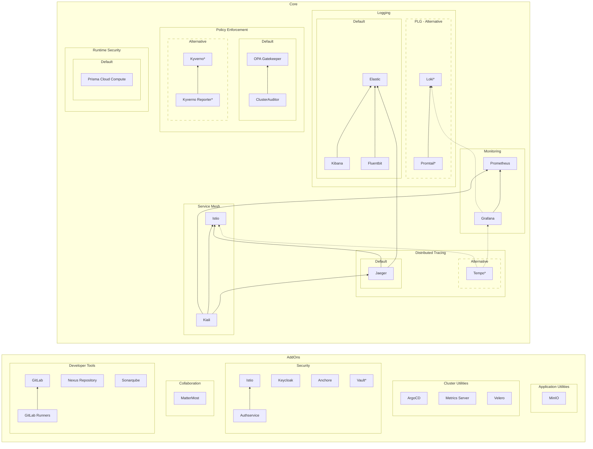
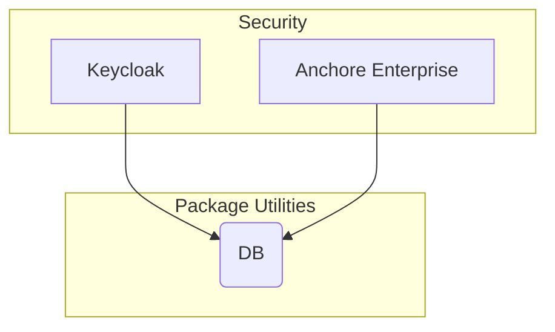
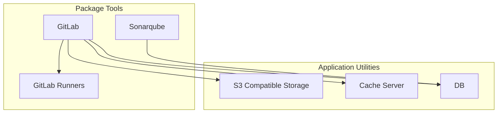
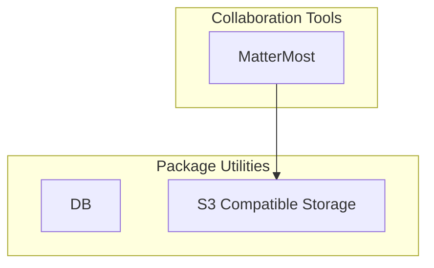
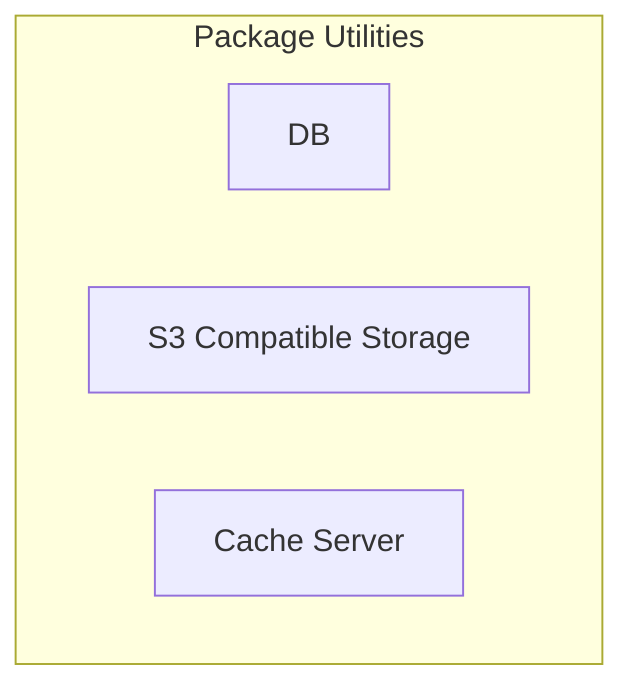

# Big Bang Packages

Each Big Bang Package is present in the [Big Bang Package](https://repo1.dso.mil/platform-one/big-bang/apps) repository and broken up into several sub-groupings.

Each package has _at least_ two `CODEOWNERS`.  Responsibilities are outlined [here](PackageOwner.md).

[[_TOC_]]

## Dependencies

> Footnotes:
>
> - Pages marked with `*` are  in Beta testing
> - Dotted lines in `Core` indicate a package that is not enabled by default
> - The following were left off the chart to keep it simple
>   - Most packages depend on Istio for encrypted traffic and ingress to web interfaces.
>   - Some packages have operators that are deployed prior to the package and manage the package's state.

## Core

Core packages make up the foundation of Big Bang.  At least one of the supported sets listed in each category must be enabled to be considered a Big Bang cluster.  These packages are designed to provide administrative support for other packages.

### Service Mesh

A service mesh is a dedicated infrastructure layer for making service-to-service communication safe, fast, and reliable.  It provides fine-grained control and enforcement of network routing into, out of, and within the cluster.  It can also supply end-to-end traffic encryption, authentication, and authorization.

Product Details:

* [Istio](packages/istio/Architecture.md)

Repositories:

* [istio-operator](https://repo1.dso.mil/platform-one/big-bang/apps/core/istio-operator)
* [istio-controlplane](https://repo1.dso.mil/platform-one/big-bang/apps/core/istio-controlplane)

### Logging

A logging stack is a set of scalable tools that can aggregate logs from cluster services and provide real-time queries and analysis.  Logging is typically comprised of three components: a forwarder, storage, and a visualizer.

### EFK Logging Stack (Default)

Product Details:

* [Elasticsearch / Kibana](packages/elasticsearch-kibana/Architecture.md) - storage and visualizer
* [Fluentbit](packages/fluentbit/Architecture.md) - forwarder

Repositories:

* [eck-operator](https://repo1.dso.mil/platform-one/big-bang/apps/core/eck-operator)
* [elasticsearch-kibana](https://repo1.dso.mil/platform-one/big-bang/apps/core/elasticsearch-kibana)
* [fluentbit](https://repo1.dso.mil/platform-one/big-bang/apps/core/fluentbit)

### PLG Logging Stack (Alternative) [BETA]

Product Details:

* [Loki](packages/elasticsearch-kibana/Architecture.md) - storage
* [Promtail](packages/promtail/Architecture.md) - forwarder
* Grafana, which is part of [monitoring](#monitoring), is used as the visualizer

Repositories:

* [loki](https://repo1.dso.mil/platform-one/big-bang/apps/core/eck-operator)
* [elasticsearch-kibana](https://repo1.dso.mil/platform-one/big-bang/apps/core/elasticsearch-kibana)
* [fluentbit](https://repo1.dso.mil/platform-one/big-bang/apps/core/fluentbit)

### Policy Enforcement

Policy Enforcement is the ability to validate Kubernetes resources against compliance, security, and best-practice policies.  If a resource violates a policy, the enforcement tool can deny access to the cluster, dynamically modify the resource to force compliance, or simply record the violation in an audit report.  Usually, a reporting tool accompanies the engine to help with analyzing and visualizing policy violations.

|Default|Group|Package|Repositories|Notes|
|--|--|--|--|--|--|
|X|Gatekeeper|[OPA Gatekeeper](packages/opa-gatekeeper/Architecture.md)|[policy](https://repo1.dso.mil/platform-one/big-bang/apps/core/policy)|Engine & Policies
|X|Gatekeeper|[Cluster Auditor](packages/cluster-auditor/Architecture.md)|[cluster-auditor](https://repo1.dso.mil/platform-one/big-bang/apps/core/cluster-auditor)|Reporting
| |Kyverno|[Kyverno](packages/kyverno/Architecture.md)|[kyverno](https://repo1.dso.mil/platform-one/big-bang/apps/sandbox/kyverno)|Engine
| |Kyverno|Kyverno Policies|[kyverno-policies](https://repo1.dso.mil/platform-one/big-bang/apps/sandbox/kyverno-policies)|Policies
| |Kyverno|Kyverno Reporter|[kyverno-reporter](https://repo1.dso.mil/platform-one/big-bang/apps/sandbox/kyverno-reporter)|Reporting
Product:

### Monitoring

Monitoring is provided by Prometheus and Grafana.

Product:

* [Prometheus](https://prometheus.io/)
* [Grafana](https://grafana.com/)

Repository:

* [Monitoring Repo](https://repo1.dso.mil/platform-one/big-bang/apps/core/monitoring)

Dependencies: None

Owners:

* [CODEOWNERS](https://repo1.dso.mil/platform-one/big-bang/apps/core/monitoring/-/blob/main/CODEOWNERS)

### Cluster Auditor

Cluster Auditor is an internal tool that provides compliance information to Cluster Owners and Application Developers for insight into Reference DevSecOps compliance

Product:

Repository: [Cluster Auditor](https://repo1.dso.mil/platform-one/big-bang/apps/core/cluster-auditor)

Dependencies:

* [Logging](#logging)
* [OPA Gatekeeper](#policy-enforcement)

Owners:

* [CODEOWNERS](https://repo1.dso.mil/platform-one/big-bang/apps/core/cluster-auditor/-/blob/main/CODEOWNERS)

Repository:

* [Cluster Auditor Repo](https://repo1.dso.mil/platform-one/big-bang/apps/core/cluster-auditor)

### Jaeger

Jaeger is an end-to-end distributed tracing tool for monitoring and troubleshooting cluster services.

Product:

* [Jaeger](https://jaegertracing.io/)

Repository:

* [Jaeger Repo](https://repo1.dso.mil/platform-one/big-bang/apps/core/jaeger)

Dependencies: None

Owners:

* [CODEOWNERS](https://repo1.dso.mil/platform-one/big-bang/apps/core/jaeger/-/blob/main/CODEOWNERS)

### Kiali

Kiali is a management console for the Istio service mesh.

Product:

* [Kiali](https://kiali.io/)

Repository:

* [Kiali Repo](https://repo1.dso.mil/platform-one/big-bang/apps/core/kiali)

Dependencies: None

* [Istio](#service-mesh)

Owners:

* [CODEOWNERS](https://repo1.dso.mil/platform-one/big-bang/apps/core/kiali/-/blob/main/CODEOWNERS)

### Twistlock

Twistlock provides runtime vulnerability detection

Product:

* [Twistlock](https://www.twistlock.com/labs-/)

Repository: [Twistlock Repo](https://repo1.dso.mil/platform-one/big-bang/apps/security-tools/twistlock)

Dependencies:

* RWO StorageClass

Owners:

* [CODEOWNERS](https://repo1.dso.mil/platform-one/big-bang/apps/security-tools/twistlock/-/blob/main/CODEOWNERS)

## Addons

Addons are supported Big Bang packages that come disabled by default.

### Auth Service

authservice helps delegate the OIDC Authorization Code Grant Flow to the Istio mesh. authservice is compatible with any standard OIDC Provider as well as other Istio End-user Auth features, including Authentication Policy and RBAC. Together, they allow developers to protect their APIs and web apps without any application code required.

Product:

* [authservice](https://github.com/istio-ecosystem/authservice)

Repository:

* [authservice](https://repo1.dso.mil/platform-one/big-bang/apps/core/authservice)

Dependency: None

Owners:

* [CODEOWNERS](https://repo1.dso.mil/platform-one/big-bang/apps/core/authservice/-/blob/main/CODEOWNERS)

### Security Tools

Security Tools are hosted here: [Security Tools](https://repo1.dso.mil/platform-one/big-bang/apps/security-tools)

#### Keycloak

Keycloak provides SSO to applications.

Product:

* [Keycloak](https://www.keycloak.org/)
* [Postgres](https://www.postgresql.org/)

Repository: [Keycloak](https://repo1.dso.mil/platform-one/big-bang/apps/security-tools/keycloak)

Dependencies:

* Postgres

Owners:

* [CODEOWNERS](https://repo1.dso.mil/platform-one/big-bang/apps/security-tools/keycloak/-/blob/main/CODEOWNERS)

#### Anchore Enterprise

Product:

* [Anchore Enterprise](https://anchore.com/enterprise/)

Repository: [Anchore Enterprise Repo](https://repo1.dso.mil/platform-one/big-bang/apps/security-tools/anchore-enterprise)

Dependencies:

* postgres

Owners:

* [CODEOWNERS](https://repo1.dso.mil/platform-one/big-bang/apps/security-tools/anchore-enterprise/-/blob/main/CODEOWNERS)

### Developer Tools

Developer Tools are hosted here: [Developer Tools](https://repo1.dso.mil/platform-one/big-bang/apps/developer-tools)

#### GitLab

GitLab is a product for providing DevOps including planning, code hosting, and CICD

Product:

* [GitLab](https://docs.gitlab.com/)

Repository:

* [GitLab Repo](https://repo1.dso.mil/platform-one/big-bang/apps/developer-tools/gitlab)

Dependencies:

* postgres
* S3 compatible object store (ex: [Minio](#minio))
* Redis
* RWO StorageClass

Owners:

* [CODEOWNERS](https://repo1.dso.mil/platform-one/big-bang/apps/developer-tools/gitlab/-/blob/main/CODEOWNERS)

#### GitLab Runners

GitLab Runners are pods that run jobs for GitLab CI/CD

Product:

* [GitLab Runners](https://docs.gitlab.com/runner/)

Repository:

* [GitLab Runners Repo](https://repo1.dso.mil/platform-one/big-bang/apps/developer-tools/gitlab-runner)

Dependencies:

* [GitLab](#gitlab)

Owners:

* [CODEOWNERS](https://repo1.dso.mil/platform-one/big-bang/apps/developer-tools/gitlab-runner/-/blob/main/CODEOWNERS)

#### Sonarqube

Sonarqube provides code reviews for code quality and security

Product:

* [Sonarqube](https://www.sonarqube.org/)

Repository:

* [Sonarqube Repo](https://repo1.dso.mil/platform-one/big-bang/apps/developer-tools/sonarqube)

Dependencies:

* postgres
* RWO StorageClass

Owners:

* [CODEOWNERS](https://repo1.dso.mil/platform-one/big-bang/apps/developer-tools/sonarqube/-/blob/main/CODEOWNERS)

#### Nexus

Nexus provides a robust artifact repository, supporting artifacts of multiple programming languages

Product:

* [Nexus](https://www.sonatype.com/nexus/repository-pro)
* Scope:
  * The Nexus OSS will not be supported as the licenced pro version is required for [HA and SAML SSO capabilities](https://www.sonatype.com/nexus/repository-oss-vs-pro-features)
  * Only Licended Nexus Repository Pro will be supported

Repository:

* [Nexus](https://repo1.dso.mil/platform-one/big-bang/apps/developer-tools/nexus)

Dependencies:

Owners:

* [CODEOWNERS](https://repo1.dso.mil/platform-one/big-bang/apps/developer-tools/nexus/-/blob/main/CODEOWNERS)

### Collaboration Tools

Collaboration tools are hosted here: [Collaboration Tools](https://repo1.dso.mil/platform-one/big-bang/apps/collaboration-tools)

<!-- #### Confluence

Confluence provides a centralized workspace for collaborating on documentation

Product:

* [Confluence](https://www.atlassian.com/software/confluence)

Repository:

* [Confluence Repo](https://repo1.dso.mil/platform-one/big-bang/apps/collaboration-tools/confluence)

Dependencies:

* Postgres
* RWM StorageClass (if HA)

Owners:

* @matt.kaiser
* @branden.cobb

#### Jira

Development tool for planning and tracking team tasks

Product:

* [Jira](https://www.atlassian.com/software/jira)

Repository:

* [Jira Repo](https://repo1.dso.mil/platform-one/big-bang/apps/collaboration-tools/jira)

Dependencies:

* Postgres
* RWM StorageClass (if HA)

Owners:

* @matt.kaiser
* @branden.cobb -->

#### Mattermost

Mattermost is an open sourced messaging platform.

Product:

* [Mattermost](https://mattermost.com/)

Repository:

* [Mattermost Repo](https://repo1.dso.mil/platform-one/big-bang/apps/collaboration-tools/mattermost)ß

Dependencies:

* S3 compatible object store (ex: [Minio](#minio))

Owners:

* [CODEOWNERS](https://repo1.dso.mil/platform-one/big-bang/apps/collaboration-tools/mattermost/-/blob/main/CODEOWNERS)

### Package Utilities

Application utilities are deployments of utilities used by one or more packages.  They are usually not user facing, and are dependencies of user facing packages.

A clear an obvious example of this is PostgreSQL.

#### Minio

Minio provides S3 compatible object storage

Product:

* [MinIO](https://min.io/)

Repository:

* [Minio Package](https://repo1.dso.mil/platform-one/big-bang/apps/application-utilities/minio/)

Dependencies: None

Owners:

* [CODEOWNERS](https://repo1.dso.mil/platform-one/big-bang/apps/application-utilities/minio/-/blob/main/CODEOWNERS)

### Cluster Utilities

Packages that provider cluster level utility, such as RWX storage or generic backup capabilities.

#### ArgoCD

Product:

* [ArgoCD](https://argoproj.github.io/argo-cd/)

Repository:

* [ArgoCD Repo](https://repo1.dso.mil/platform-one/big-bang/apps/core/argocd)

Dependency: None

Owners:

* [CODEOWNERS](https://repo1.dso.mil/platform-one/big-bang/apps/core/argocd/-/blob/main/CODEOWNERS)

#### Velero

Velero is an open source tool to safely backup and restore, perform disaster recovery, and migrate Kubernetes cluster resources and persistent volumes

* [Velero](https://velero.io/)

Repository:

* [Velero Package](https://repo1.dso.mil/platform-one/big-bang/apps/cluster-utilities/velero/-/tree/main)

Owners:

* [CODEOWNERS](https://repo1.dso.mil/platform-one/big-bang/apps/cluster-utilities/velero/-/blob/main/CODEOWNERS)

### BB Technical Oversight Committee (BB TOC)

[Process](https://repo1.dso.mil/platform-one/bbtoc/-/tree/master/process)
